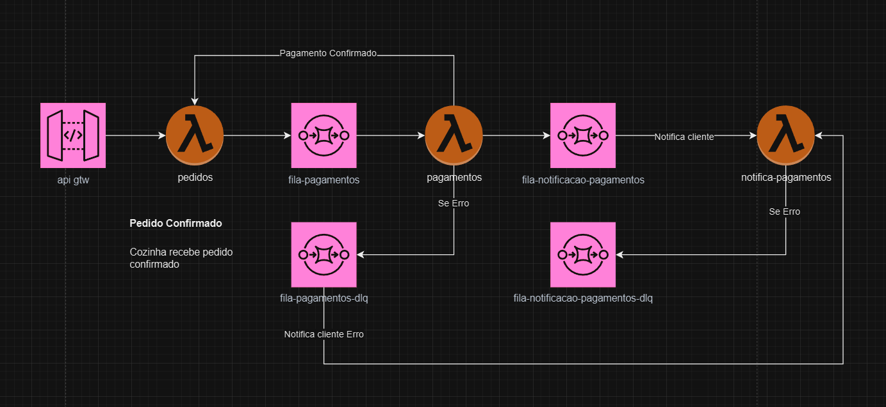

# Arquitetura de Microsserviços com Padrão SAGA de Coreografia

## Padrão SAGA de Coreografia

No padrão SAGA de Coreografia, não há um serviço central que controle o fluxo de eventos. Em vez disso, cada serviço ou componente decide autonomamente o que fazer a seguir, reagindo a eventos que chegam de outros serviços. Cada serviço conhece apenas o evento que precisa ouvir e o evento que deve emitir.

### Justificativa para o Uso de Coreografia

O uso da coreografia permite maior autonomia e desacoplamento entre os componentes do sistema. Como cada serviço reage apenas a eventos específicos, a complexidade do gerenciamento do fluxo é distribuída entre os próprios serviços, facilitando a escalabilidade e manutenção em sistemas distribuídos.

## Componentes da Arquitetura

A arquitetura é composta pelos seguintes componentes:

1. **API Gateway (api gtw):** Recebe o pedido do cliente e o encaminha para a função Lambda `pedidos`.

2. **Lambda `pedidos`:** Processa o pedido e publica um evento na fila `fila-pagamentos`.

3. **Fila `fila-pagamentos`:** Recebe o evento de pedido confirmado e aciona a Lambda `pagamentos`.

4. **Lambda `pagamentos`:** Processa o pagamento. Se o pagamento for aprovado, publica um evento na `fila-notificacao-pagamentos` e informa a lambda `pedidos` para confirmar o pedido. Em caso de erro, publica um evento na `fila-pagamentos-dlq`.

5. **Fila `fila-notificacao-pagamentos`:** Aciona a Lambda `notifica-pagamentos` para notificar o cliente sobre o status do pagamento.

6. **Lambda `notifica-pagamentos`:** Notifica o cliente sobre o sucesso ou falha do pagamento. Em caso de erro na notificação, o evento é enviado para a `fila-notificacao-pagamentos-dlq`.

7. **Filas DLQ (Dead Letter Queue):** As filas `fila-pagamentos-dlq` e `fila-notificacao-pagamentos-dlq` armazenam mensagens de erro para ações compensatórias ou tratamento manual posterior.

## Fluxo de Comunicação SAGA

### Cenário de Pagamento Aprovado

1. **Pedido Confirmado:** Após um pedido ser confirmado via API Gateway, ele é processado pela Lambda `pedidos`, que coloca a mensagem na `fila-pagamentos`.
2. **Pagamento Confirmado:** A Lambda `pagamentos` processa o pagamento. Se confirmado, a mensagem é enviada para a `fila-notificacao-pagamentos`.
3. **Notificação ao Cliente:** A Lambda `notifica-pagamentos` notifica o cliente sobre o status do pagamento. Em caso de sucesso, o cliente é notificado de que o pedido foi aprovado e o pedido é enviado para a cozinha.

### Cenário de Falha no Pagamento

1. **Erro no Pagamento:** Se houver um erro ao processar o pagamento na Lambda `pagamentos`, a mensagem é enviada para a `fila-pagamentos-dlq`.
2. **Notificação de Erro ao Cliente:** A Lambda `notifica-pagamentos` também pode falhar ao tentar notificar o cliente. Nesse caso, a mensagem é enviada para a `fila-notificacao-pagamentos-dlq`.

## Conclusão

O diagrama representa uma arquitetura de microsserviços baseada em eventos, utilizando um padrão SAGA de Coreografia para gerenciar transações distribuídas. Este padrão oferece um sistema mais descentralizado, onde cada componente sabe apenas o que fazer em resposta a um evento, aumentando o desacoplamento e a escalabilidade da solução.

## Considerações Finais

Esta arquitetura permite que, quando o pagamento é aprovado, o cliente seja notificado e a cozinha receba o pedido confirmado. Em caso de falha no pagamento, a cozinha não recebe o pedido, e o cliente é notificado sobre o problema.
